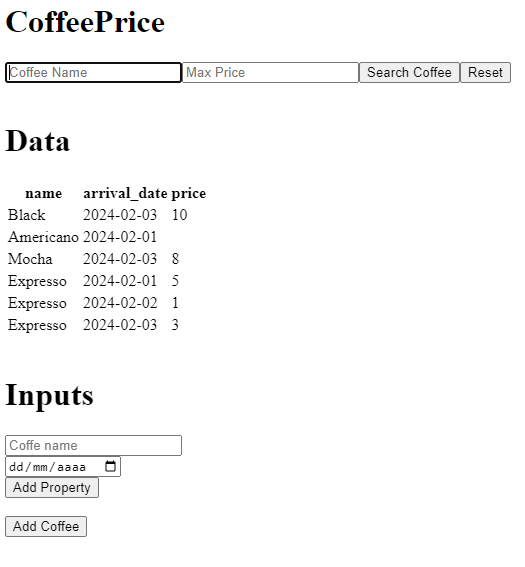
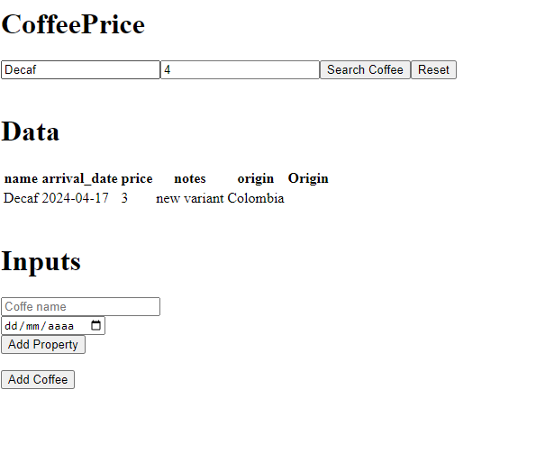

Explanation 

For this architecture, we will have a docker compose that does the following:
- Dynamo Database
- Docker file called Dockerfile.service_setup
  - It takes care of creating the table and some records
- Next Js application to interact with DynamoDB

Preparation 

Start by running:

1. docker rm localstack_main -f
2. docker compose up --build service_setup

Open client in a new terminal

Run:

cd dynamo-workshop

npm install

npm run dev

Expected Result:

Exercise:

Then start solving the following items: 

1 - Right now the UI is capable of support extra properties apart from Name and Arrival Date, user wants to add other columns and show it in the UI. Important: Only change should occur in React (DynamoPage). Feel free to add console.log to inspect the API.

2 - User want to search by a coffee name where price is lower than. UI is ready, but API is not, please complete. (Fix coffeePrice.js only)

Final Result:

