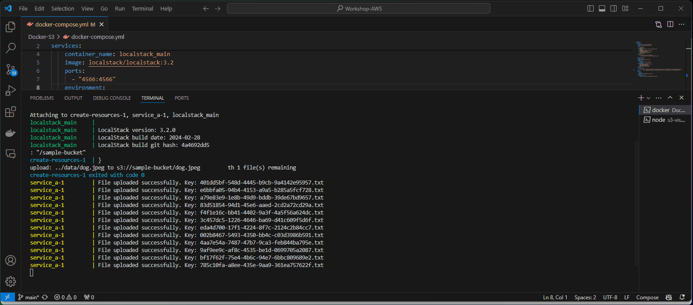
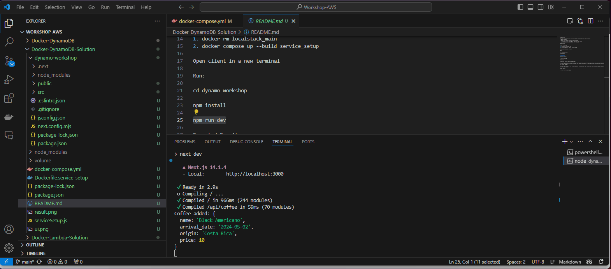
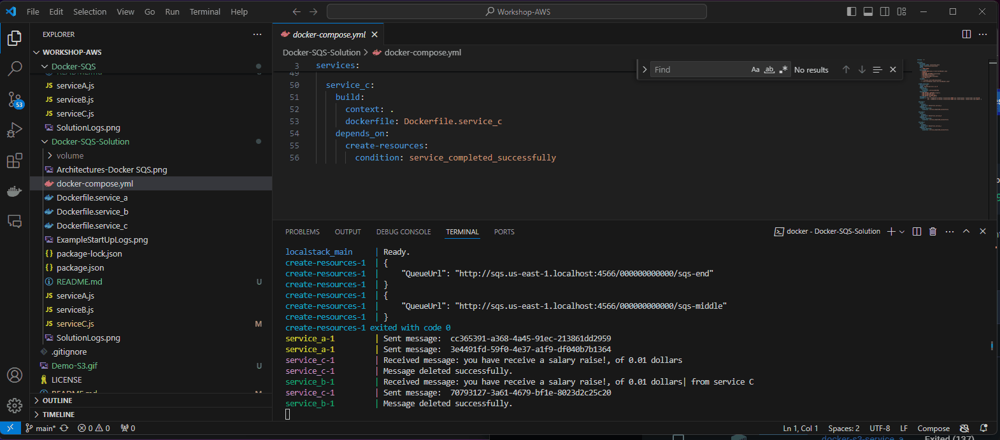
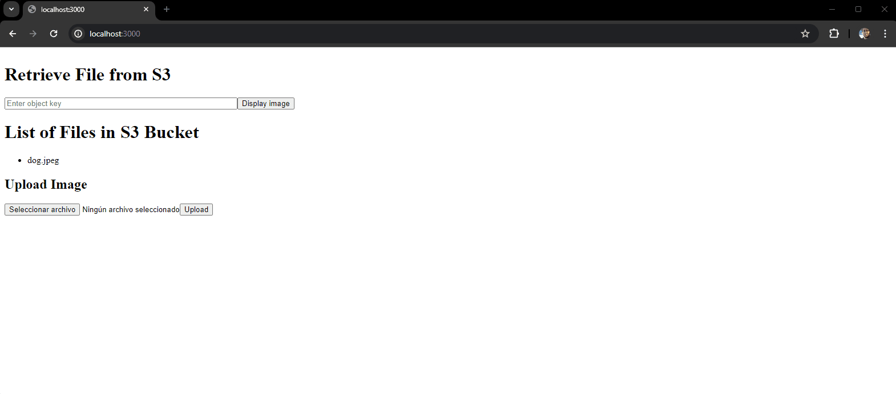

# Basic AWS Workshop

Technologies:

- Docker
- AWS
- LocalStack
- Next.js or Node.Js

Purpose: Created as part of workshop given to engineers.

## Services 

### S3

____

### Dynamo

____

### SQS

____

### Lambda

Exercises and solutions.